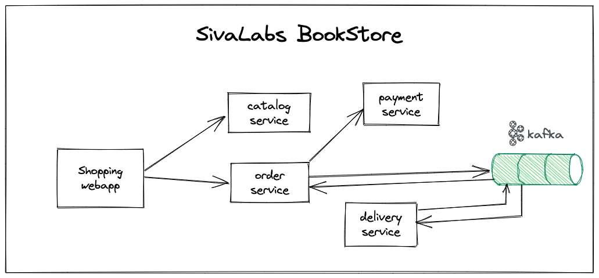

# BookStore
BookStore is an online shopping application selling books.

## Goal
The main goal of building this application is to learn various technologies by building a reasonably complex application.

## Technical Architecture
The key components of BookStore application are:

* **bookstore-webapp:** This is the customer facing web application where they can browse through available books, add books to cart and place an order.
* **bookstore-backoffice:** This is a backoffice web application used by administrators and staff to setup the books catalog and manage orders.
* **backing-services:** These are domain-oriented backend services that fulfill the needs for bookstore-webapp and bookstore-backoffice.

We would like to build the backing-services as independently deployable microservices so that each service can be developed in the preferred language/framework.
Most of these backing-services will expose REST APIs to be consumed by webapp, backoffice and also by other APIs.
Some backing-services could be only event processors where they consume events from an event store(Kafka, RabbitMQ etc), process them and optionally publish other events.

The web applications bookstore-webapp, bookstore-backoffice could be implemented using SPA frameworks like Angular, VueJS, ReactJS etc
or using server-side rendering technologies like Thymeleaf.

## Backend Services

1. [catalog-service](catalog-service.md)
2. [payment-service](payment-service.md)
3. [order-service](order-service.md)
4. [delivery-service](delivery-service.md)

## Typical application flow
A typical application usage flow looks like:

* Customer browse through product catalog
* Add preferred products to cart
* Go to checkout page
* Enter customer details, delivery address, payment details.
* Place order
    * Validate order details
    * Validate Payment details
    * If payment details is valid then set status to "NEW" otherwise to "ERROR"
    * Save order details in DB
    * Publish OrderCreated Event
    * If payment details is invalid then Publish OrderError Event
* Order Processing
    * Order-service receives OrderCreated Event and send an email notification to customer
    * Order-service receives OrderError Event and send an email notification to customer
    * Delivery-service receives OrderCreated Event and save order with status READY_TO_SHIP
    * Delivery-service DeliveryJob update local status from READY_TO_SHIP to DELIVERED and then publish OrderDelivered Event
    * Order-service receives OrderDelivered Event and update status to DELIVERED
    * Order-service receives OrderDelivered Event and send an email notification to customer
* Customer receives order update emails with a link to view current order details.

## How to contribute?
* Run the application and let us know if you face any issue
* Review the code and add your review comments
* Contribute implementation of a service in your favourite language/framework
